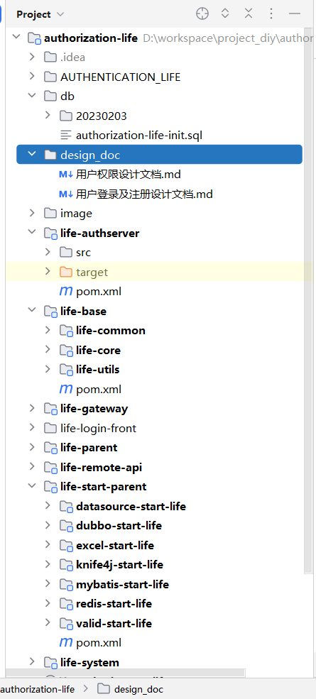

# authorization-life ：鉴权的一生

## 前后端分离Oauth2.0的实践

### 自定义maven工程 与 spring-security + spring-authorization-server 深度整合实践。

## 公共模块：

### life-parent

#### 管理所有模块的公共依赖，主要包含 lombok、hutool、guava、等springboot工程中默认需要的组件。

### life-common

#### 管理web服务、注册组件、工具类的公共依赖，如果某一个服务需要作为web服务进行与前端做交互，则需要引入此依赖。

### life-core

#### 管理公共的认证配置、jwt的解析、服务上下线的注册、服务的启动和停止的配置、等对于每一个服务所需的公共配置信息。

### life-start-parent

#### 管理 mybatis-plus、redis、util工具包、等可以自行发挥想象，定义所需的start。

## 认证授权中心(oauth2.0中的server端)：

### life-authserver

#### 集成spring-security、spring-authorization-server 深度整合Oauth2.0的模块，作为认证和授权服务，将认证用户和颁发token。

## 网关：

### life-gateway

#### 服务上下线的监听(动态路由的实现)，Authorization 的解析、校验权限，自定义路由，url路径的校验，gateway断路器的配置， 等一些可以在网关层次做的操作。

## 系统设置服务(oauth2.0中的client端)：

### life-system

#### 系统中的字典、业务配置、系统的默认参数、等等，需要产品的具体的需求。

## 前端工程

#### 后端springboot服务与前端vue服务是一一对应的。相当于系统中的某一个模块，模块的请求网址路径就是vue工程的baseUrl，后端请求的路径将直接请求网关gateway，网关会根据请求路径的不一致进行路由分发，从而获取数据信息。

### life-authserver-front

#### 认证授权中心的前端工程，用于登录的认证和授权。

### 使用的框架技术：

后端：

spring-boot 2.7.3

spring-cloud 2021.0.3

spring-cloud-alibaba 2.2.8.RELEASE

spring-security 5.7.3

spring-security-oauth2-authorization-server 0.3.1

dubbo 3.2.0
前端：

vue2.0

## 工程结构图：


## 新的工程结构图：



## Oauth2.0的授权模式的概念

### 授权的四种方式

https://www.ruanyifeng.com/blog/2019/04/oauth-grant-types.html

### 授权方式的图解

https://learnku.com/articles/20082

### 实践Oauth2.0前后端分离两个步骤

#### 1、spring-boot 与 spring-security 集成

参考：

https://blog.csdn.net/xiaokanfuchen86/article/details/109002266

https://blog.csdn.net/qq_43799161/article/details/123854833

#### 2、spring-boot 与 spring-security 、oauth2-authorization-server 、 spring-cloud-gateway 集成

参考：

https://github.com/spring-projects/spring-authorization-server

https://blog.51cto.com/u_14558366/5605065

## 此工程对应的博客专栏

https://blog.csdn.net/qq_38046739/category_12090398.html

## 授权码模式（authorization-code）

### 博文：

https://blog.csdn.net/qq_38046739/article/details/127752149

### 流程：

1、访问 https://www.authorization.life ， 将跳转到 https://www.authorization.life/login 登录页面。

2、输入用户名密码
用户名：qjyn1314@163.com
密码：admin

3、用户名密码验证通过之后，将重定向到：https://www.authorization.life/login/hometemporary?code=gyLKC_d06yIPo-69hbKuVOFfFjps3F-EPRbAwilmQZPYO0TBkY2GORjhyZ1CXxeUeeC8d5rHY8g8j3Wykhiv_T17P-QYsbFDWvBzJcvfKk0oF8Z8Nj_CgLhSLFiIskL4&state=authorization-life

4、login-front前端工程中的 home 页面中做一些操作，通过 网址中的 code 请求 /oauth2/token 接口 ，获取自定义的 jwt形式的 accessToken，然后将其保存到cookie中，为下一次请求接口使用。


### 结果：


## 客户端凭证（client credentials）

博文:

https://blog.csdn.net/qq_38046739/article/details/127774901


流程:

1.post请求接口
https://www.authorization.life/auth-life/oauth2/token

传参:

grant_type： client_credentials – 验证方式.

client_id： passport – 申请时的 client信息

client_secret：3MMoCFo4nTNjRtGZ – 申请的密码明文


## 部署(windows)

1. git clone https://github.com/qjyn1314/authorization-life.git
2. 执行 db文件夹下的 所有MySQL文件,创建表,添加 domain_name字段和security_bak字段, 更改 life-authserver 链接的数据库名和密码.
3. docker 部署redis ,或者 windows安装redis, 需要redis服务支持, 更改端口号为 : 7777
4. 在 阿里云平台中申请域名, 下载 ssl 证书.
5. 部署nginx , 或者 windows中安装nginx , 进行配置 nginx的 的代理.
6. 部署和启动 nacos 单机模式, 部署后端网关- 启动 life-gateway 服务, 部署认证中心和鉴权服务- 启动 life-authserver 服务.
7. 部署前端, 进入 life-authserver-front 文件后 , npm install , npm run dev 启动 vue工程.


注意: 其中 每个springboot服务中,redis的配置是一致的, 使用  0号  数据库.


## nginx.conf文件的配置项

```bash
#user  nobody;
worker_processes  auto;

#error_log  logs/error.log;
#error_log  logs/error.log  notice;
#error_log  logs/error.log  info;

#pid        logs/nginx.pid;

events {
    worker_connections  1024;
}

http {
    include       mime.types;
    default_type  application/octet-stream;

	# 需要配置 nginx: [emerg] could not build server_names_hash, you should increase server_names_hash_bucket_size: 32   解决此错误需要增加下两行配置
	server_names_hash_max_size 		2048;# 【值为域名长度总和】
	server_names_hash_bucket_size 	2048;# 【上升值】

    #log_format  main  '$remote_addr - $remote_user [$time_local] "$request" '
    #                  '$status $body_bytes_sent "$http_referer" '
    #                  '"$http_user_agent" "$http_x_forwarded_for"';
	# 需要配置 /sockjs-node 访问异常->
	# 参考：https://blog.csdn.net/qq27229639/article/details/103069055
	#       https://www.ancii.com/anbgjpemb
	map $http_upgrade $connection_upgrade {
		default upgrade;
		''      close;
    }

    #access_log  logs/access.log  main;

    sendfile        on;
    #tcp_nopush     on;

    #keepalive_timeout  0;
    keepalive_timeout  65;

    #gzip  on;
  
    # another virtual host using mix of IP-, name-, and port-based configuration
    #

# ------------------------------------------www.authorization.life ssl 配置-----------------------------

    server {
        listen       80;
        server_name  www.authorization.life;
        rewrite ^(.*)$ https://$server_name$1 permanent;
    }

    server {
        listen       443 ssl;
        server_name  www.authorization.life;

        ssl_certificate      D:\\devops_install\\nginx_install\\ssl_cert\\www.authorization.life_nginx\\www_authorization.life.pem;
        ssl_certificate_key  D:\\devops_install\\nginx_install\\ssl_cert\\www.authorization.life_nginx\\www_authorization.life.key;

		    # ssl验证相关配置
		ssl_protocols 			TLSv1.3 SSLv3; #安全链接可选的加密协议
        ssl_ciphers         EECDH+AESGCM:EDH+AESGCM;
       	ssl_ecdh_curve 			secp384r1; #为ECDHE密码指定 SEPO384Q1
		ssl_session_timeout  10m;       #缓存有效期
        #ssl_session_cache   shared:SSL:10m;
		ssl_prefer_server_ciphers   on; 
		ssl_session_tickets         off; # Requires nginx >= 1.5.9
		ssl_stapling                on; # Requires nginx >= 1.3.7
		ssl_stapling_verify         on; # Requires nginx => 1.3.7

		#后端服务gateway
        location / {
            proxy_set_header X-Forwarded-For $proxy_add_x_forwarded_for;
		        proxy_set_header X-Forwarded-Proto $scheme;
		        proxy_set_header Host $http_host;
		        proxy_redirect off;
		        proxy_pass http://127.0.0.1:9000;
        }

        # 前端登录工程
        location /login {
		        proxy_pass http://127.0.0.1:8145;
		        proxy_http_version 1.1;
    				proxy_set_header Upgrade $http_upgrade;
    				proxy_set_header Connection $connection_upgrade;
            proxy_set_header X-Forwarded-For $proxy_add_x_forwarded_for;
		        proxy_set_header X-Forwarded-Proto $scheme;
		        proxy_set_header Host $http_host;
		        proxy_redirect off;
        }
    }

# ------------------------------------------www.authorization.life ssl 配置-----------------------------

}


```

## 项目中遇到的问题

### 一. 项目中使用了 jdk17 + orika 序列化框架,项目中使用到了 orikaBean转换工具类会出现以下错误信息

```
java.lang.reflect.InaccessibleObjectException: Unable to make protected native java.lang.Object java.lang.Object.clone() throws java.lang.CloneNotSupportedException accessible: module java.base does not "opens java.lang" to unnamed module @7671cb68
```

#### 参考:

https://github.com/orika-mapper/orika/issues/377

#### 解决方法:

添加jvm启动参数:

--add-opens java.base/java.lang=ALL-UNNAMED

### 二. 待记录
