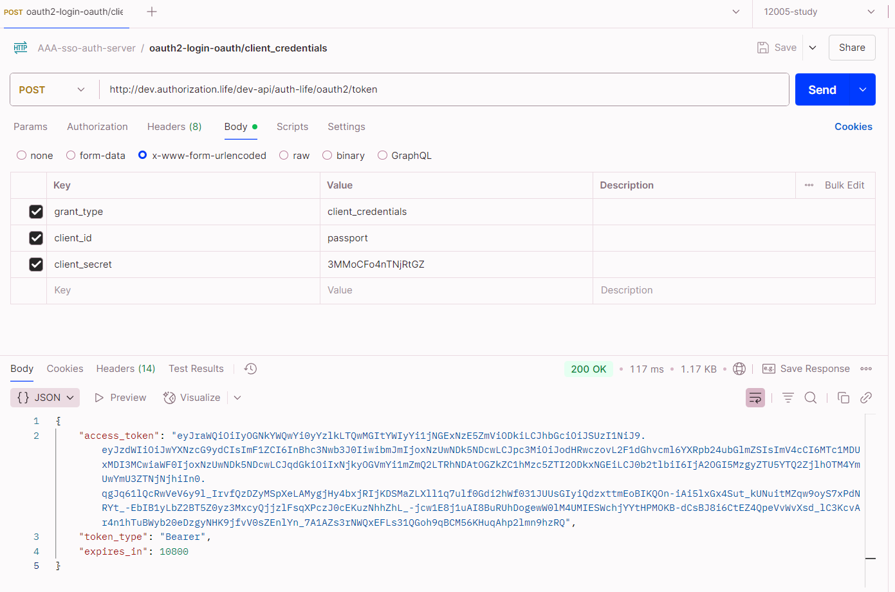

# authorization-life oauth2.0 授权服务

## 前后端分离Oauth2.0的实践

自定义maven工程 与 spring-security + spring-authorization-server 深度整合实践。

# 项目结构

## 公共模块：

### [life-base](life-base)

管理所有模块的公共依赖，主要包含 lombok、hutool、guava、等springboot工程中默认需要的组件。

### [life-common](life-base/life-common)

管理web服务、注册组件、工具类的公共依赖，如果某一个服务需要作为web服务进行与前端做交互，则需要引入此依赖。

### [life-core](life-base/life-core)

管理公共的认证配置、jwt的解析、服务上下线的注册、服务的启动和停止的配置、等对于每一个服务所需的公共配置信息。

### [life-utils](life-base/life-utils)

当前登录用户的获取, jwt的解析, json的ObjectMapper适配, 加密解密工具, 监听springboot等事件信息

### [life-start-parent](life-start-parent)

管理定义所需的start。

### [dubbo-start-life](life-start-parent/dubbo-start-life)

dubbo 配置, nacos服务注册中心和配置中心

### [knife4j-start-life](life-start-parent/knife4j-start-life)

OpenApi文档助手

### [lov-start-life](life-start-parent/lov-start-life)

字典翻译, 查询字典信息

### [mail-start-life](life-start-parent/mail-start-life)

发送邮件工具类

### [mybatis-start-life](life-start-parent/mybatis-start-life)

orm持久层, mybatis-plus, 

### [redis-start-life](life-start-parent/redis-start-life)

redis 工具类, 发布和订阅服务, 分布式锁等.

### [security-start-life](life-start-parent/security-start-life)

Oauth2.0 授权认证服务

### [valid-start-life](life-start-parent/valid-start-life)

请求的参数校验

### [life-gateway](life-gateway)

服务上下线的监听(动态路由的实现)，Authorization 的解析、校验权限，自定义路由，url路径的校验，gateway断路器的配置， 等一些可以在网关层次做的操作。

### [life-remote-api](life-remote-api)

服务之间相互调用基本依赖, 前提是已经依赖了 [dubbo-start-life](life-start-parent/dubbo-start-life) 

### [authserver-remote-api](life-remote-api/authserver-remote-api)

authserver-授权服务提供的dubbo服务接口

### [system-remote-api](life-remote-api/system-remote-api)

system-系统管理服务提供的dubbo服务接口

### [life-authserver](life-authserver) 授权认证的服务端(oauth2.0中的server端)

集成spring-security、spring-authorization-server 深度整合Oauth2.0的模块，作为认证和授权服务，将认证用户和颁发token。

### [life-system](life-system) 系统管理服务(oauth2.0中的client端)

系统中的字典、业务配置、系统的默认参数、等等具体的需求。

### [front-auth](front-auth) 前端工程

包含 认证授权中心，用于登录的认证和授权。系统字典的管理, 消息模板, 表单模板的管理, 等等所有的功能.

## 开发环境

jdk17

mysql 9.3.0

nacos v2.5.1

redis 8.0.1

nbodejs v24.1.0

npm 11.4.0

vue @vue/cli 5.0.8

## 后端框架

spring-boot 3.5.0

spring-cloud 2025.0.0

spring-cloud-alibaba 2023.0.3.3

dubbo 3.3.4

## 前端框架vue3-函数式编程(面向对象的编程思想)

#### "vue": "^3.5.16"

#### "pinia": "^3.0.3"

#### "element-plus": "^2.10.0"

#### "axios": "^1.9.0"

# Oauth2.0的授权模式的概念

授权的四种方式

https://www.ruanyifeng.com/blog/2019/04/oauth-grant-types.html

授权方式的图解

https://learnku.com/articles/20082

## 实践Oauth2.0前后端分离两个步骤

1. spring-boot 与 spring-security 整合

参考：

https://blog.csdn.net/xiaokanfuchen86/article/details/109002266

https://blog.csdn.net/qq_43799161/article/details/123854833

2. spring-boot 与 spring-security 、oauth2-authorization-server 、 spring-cloud-gateway 集成

参考：

https://github.com/spring-projects/spring-authorization-server

https://blog.51cto.com/u_14558366/5605065

# 此工程对应的博客专栏

https://blog.csdn.net/qq_38046739/category_12090398.html

# 授权码模式（authorization-code）

### 博文

https://blog.csdn.net/qq_38046739/article/details/127752149

### 授权码模式授权登录思路

##### 1. 获取授权路径: 前端启动成功后默认访问页面: http://dev.authorization.life/clients 


##### 2. 点击"请求授权URL(即登录按钮)"按钮时请求授权路径 http://dev.authorization.life/dev-api/auth-life/oauth2/authorize?response_type=code&client_id=passport_dev&scope=TENANT&state=78b65c262156412ea45ac12e5ac8f269&redirect_uri=http://dev.authorization.life/auth-redirect , 并直接跳转到 http://dev.authorization.life/login?redirect_uri=http://dev.authorization.life/auth-redirect 登录页面。


##### 3. 输入用户名密码
用户名：qjyn1314@163.com
密码：admin

##### 4. 用户名密码验证通过之后，将重定向到： http://dev.authorization.life/auth-redirect?code=_nQESeSDC0cYcgrdbQQf2HOMNEl5zxz1hP-qzwuSeVsJ--5rJsqu_tKGKSv_Rsx_N5bXn309p71zEx9BuLLKJT4OU8Pw42w4f8eVO06s4FqhGgbin_i7v1379XBf0atm&state=4946cb97e744467b9086722234a09f3e 

> 说明: 用户已经登录成功, 但是需要授权token, 当前浏览器会话中, (spring-boot-starter-security)已经将登录成功用户信息存放至SecurityContext缓存中. 此处路径中的 /auth-redirect 就对应着前端工程的临时授权页面, 主要是(spring-security-oauth2-authorization-server)为了颁发token, 但是在颁发token之前, 在此页面中可以进行发送短信验证码, 或者发送邮箱验证码, 或者二维码验证, 再次验证用户是否真实, 待通过后再次请求 /oauth2/token 接口. 

授权码模式的前端临时code获取授权页面:


##### 5. [front-auth](front-auth)前端工程中的 [TemporaryAuth.vue](front-auth/src/views/auth/TemporaryAuth.vue) 临时授权页面，通过
网址中的 code 请求 /oauth2/token 接口 ，获取自定义的 jwt形式的 accessToken，然后将其保存到cookie中，为下一次请求接口使用。

授权码模式的获取AccessToken的请求: 


授权码模式的获取AccessToken的结果:


授权码模式的token持久化:


##### 6. 在设置完登录用户的token时, 跳转到系统的首页.

授权模式的登录成功的Cookie


授权码模式的登录成功的LocalStorage


# 客户端凭证（client credentials）

博文:

https://blog.csdn.net/qq_38046739/article/details/127774901

流程:

1.post请求接口
http://dev.authorization.life/dev-api/auth-life/oauth2/token

传参:

grant_type： client_credentials – 验证方式.

client_id： passport – 申请时的 client信息

client_secret：3MMoCFo4nTNjRtGZ – 申请的密码明文




# 部署和访问页面

1. git clone https://github.com/qjyn1314/authorization-life.git
2. 执行初始化sql文件:  [life_20250621_allinit.sql](db/life_20250621_allinit.sql)
3. 部署 mysql: 33010, nacos v2.5.1: 12095, redis: 12040
4. 部署 nginx 1.27.2 , 并配置 dev.authorization.life 域名的转发
5. 部署前端, 进入 front-auth 文件后 , npm npm install , npm run dev 启动 vue工程.
6. 启动认证授权服务 [AuthServerLifeApplication.java](life-authserver/src/main/java/com/authorization/life/auth/AuthServerLifeApplication.java) 9030, 网关服务 [GatewayLifeApplication.java](life-gateway/src/main/java/com/authorization/gateway/GatewayLifeApplication.java) 9000 
7. 访问地址: http://dev.authorization.life/clients

> 注意: 其中 每个springboot服务中,redis的配置是一致的, 使用 0号 数据库.

# nginx.conf文件的配置项

```bash
#user  nobody;
worker_processes  auto;

#error_log  logs/error.log;
#error_log  logs/error.log  notice;
#error_log  logs/error.log  info;

#pid        logs/nginx.pid;

events {
    worker_connections  1024;
}

http {
    include       mime.types;
    default_type  application/octet-stream;

	# 需要配置 nginx: [emerg] could not build server_names_hash, you should increase server_names_hash_bucket_size: 32   解决此错误需要增加下两行配置
	server_names_hash_max_size 		2048;# 【值为域名长度总和】
	server_names_hash_bucket_size 	2048;# 【上升值】

    #log_format  main  '$remote_addr - $remote_user [$time_local] "$request" '
    #                  '$status $body_bytes_sent "$http_referer" '
    #                  '"$http_user_agent" "$http_x_forwarded_for"';
	# 需要配置 /sockjs-node 访问异常->
	# 参考：https://blog.csdn.net/qq27229639/article/details/103069055
	#       https://www.ancii.com/anbgjpemb
	map $http_upgrade $connection_upgrade {
		default upgrade;
		''      close;
    }

    #access_log  logs/access.log  main;

    sendfile        on;
    #tcp_nopush     on;

    #keepalive_timeout  0;
    keepalive_timeout  65;

    #gzip  on;
  
    # another virtual host using mix of IP-, name-, and port-based configuration
    #

# ------------------------------------------dev.authorization.life  配置-----------------------------

    # 进入到网站的首页
    server {
        # 监听浏览器的80端口
        listen       80;
        # 访问域名
        server_name  dev.authorization.life;
        #后端服务gateway
        location /dev-api/ {
		       proxy_pass http://127.0.0.1:9000/;
               proxy_set_header X-Forwarded-For $proxy_add_x_forwarded_for;
		       proxy_set_header X-Forwarded-Proto $scheme;
		       proxy_set_header Host $http_host;
		       proxy_redirect off;
        }
        # 前端VUE工程
        location / {
                proxy_pass http://127.0.0.1:18888;
                proxy_http_version 1.1;
                proxy_set_header Upgrade $http_upgrade;
                proxy_set_header Connection $connection_upgrade;
                proxy_set_header X-Forwarded-For $proxy_add_x_forwarded_for;
                proxy_set_header X-Forwarded-Proto $scheme;
                proxy_set_header Host $http_host;
                proxy_redirect off;
        }
    }

# ------------------------------------------dev.authorization.life  配置-----------------------------

}


```

# 数据库表说明

[life_20250621_allinit.sql](db/life_20250621_allinit.sql)


官网的授权客户端表 对应本项目中的 liam_oauth_client
```url
https://github.com/spring-projects/spring-authorization-server/blob/main/oauth2-authorization-server/src/main/resources/org/springframework/security/oauth2/server/authorization/client/oauth2-registered-client-schema.sql
```

官网的授权页面信息, 本项目中使用redis进行存储, 服务类: [RedisOAuth2AuthorizationConsentService.java](life-authserver/src/main/java/com/authorization/life/auth/infra/security/service/RedisOAuth2AuthorizationConsentService.java) 
```url
https://github.com/spring-projects/spring-authorization-server/blob/main/oauth2-authorization-server/src/main/resources/org/springframework/security/oauth2/server/authorization/oauth2-authorization-consent-schema.sql
```

官网的授权AccessToken, 临时code, RefreshToken信息, 在本项目中使用redis 进行存储, 服务类: 
[RedisOAuth2AuthorizationService.java](life-authserver/src/main/java/com/authorization/life/auth/infra/security/service/RedisOAuth2AuthorizationService.java)
```url
https://github.com/spring-projects/spring-authorization-server/blob/main/oauth2-authorization-server/src/main/resources/org/springframework/security/oauth2/server/authorization/oauth2-authorization-schema.sql
```


用户表  liam_user

用户分组表 liam_user_group

字典主表  lsys_lov

字典子表  lsys_lov_value

模板主表 lsys_temp

模板与用户关联表 lsys_temp_user


